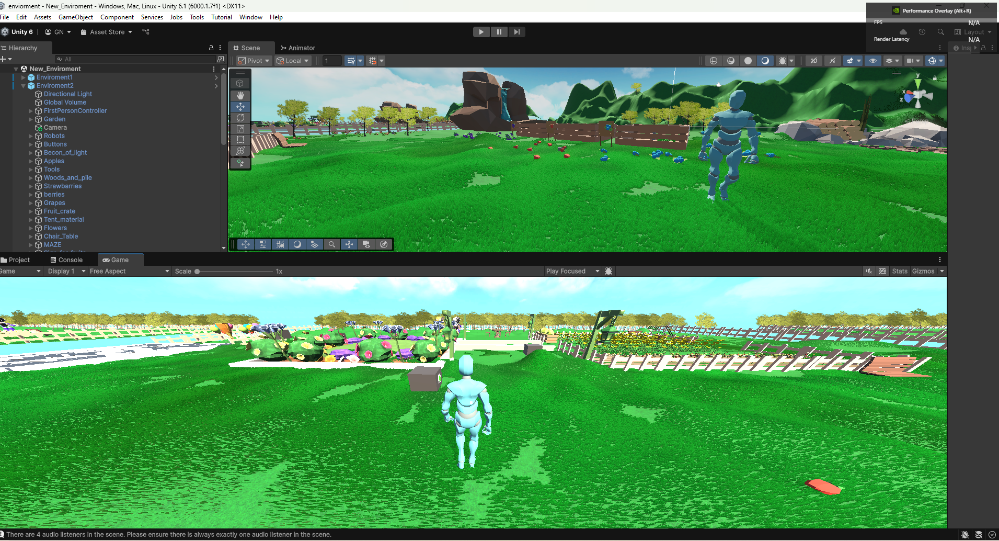
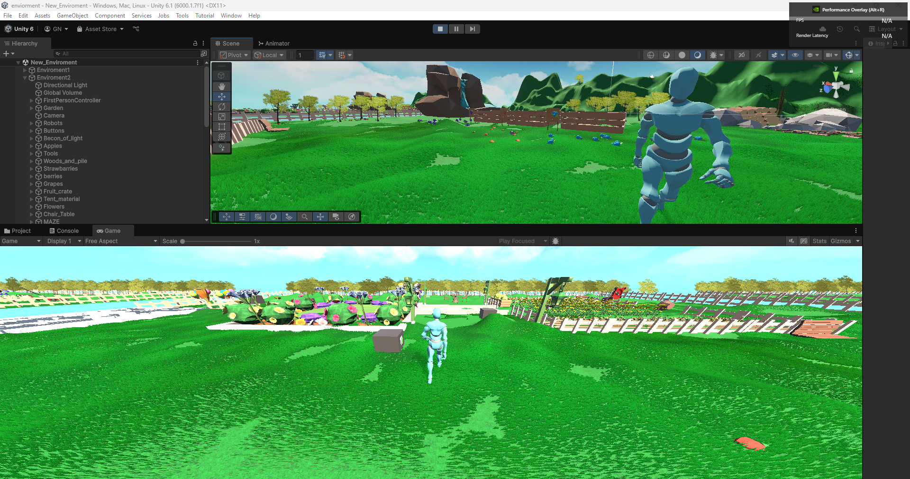

# 🌱 Harmony Garden RL  
**Reinforcement Learning in Unity with Intrinsic Motivation & Interactable Environments**

---

## 📖 Overview
**Harmony Garden RL** is a Unity-based reinforcement learning project where an autonomous robot learns to navigate, interact, and explore a dynamic garden environment.  
The agent is powered by **Unity ML-Agents** and uses a few **extrinsic rewards** to encourage exploration and **intrinsic curiosity**.

This project demonstrates:
- **Physics-based movement** with realistic constraints
- **Multiple interactable objects** (buttons, apples, chairs, water zones, etc.)
- **Intrinsic motivation** via curiosity-driven exploration
- PPO-based training with configurable hyperparameters

---

## 🎥 Demo Video
Watch the robot training in action:

> Click the thumbnail to play the video in your browser.

---

## 🤖 The Agent  
The **RobotAgent**:
- Uses **Vector Observations**: velocity, states, and nearby interactables
- Has discrete actions:
  - Move (forward, back, left, right)
  - Turn (left, right)
  - Interact
- Rewards:
  - Extrinsic rewards for completing tasks
  - Small bonuses for novel interactions
  - Curiosity-driven intrinsic rewards for exploration

---

## 🎯 Features
- 🏃 **Smooth & grounded robot locomotion** (acceleration, max speed, turn speed)
- 🧠 **Curiosity module** for intrinsic motivation
- 🪴 **Interactables**:
  - Apple pickup
  - Chair sitting
  - Water play zone
  - Buttons & maze goals
- 📦 Modular **C# scripts** for Agents, Config, and Interactables
- ⚙️ Fully configurable **YAML training settings**
- 🎥 Visualizable **training process in Unity**

---

## ⚙️ Training Setup
Training is powered by **Unity ML-Agents** using the PPO algorithm.

## 📷 Screenshots

| Robot Exploring | Taking Forward Steps |
|-----------------|----------------------|
|  |  |

---

## 📜 License
This project is licensed under the **Apache 2.0 License** - see the [LICENSE](./LICENSE) file for details.

